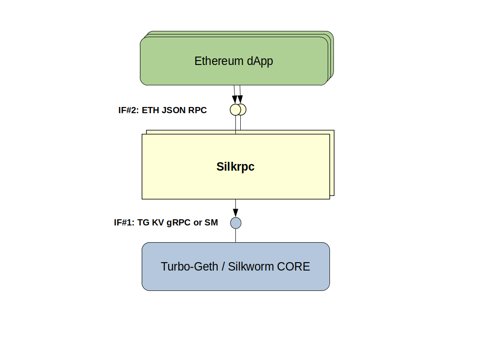
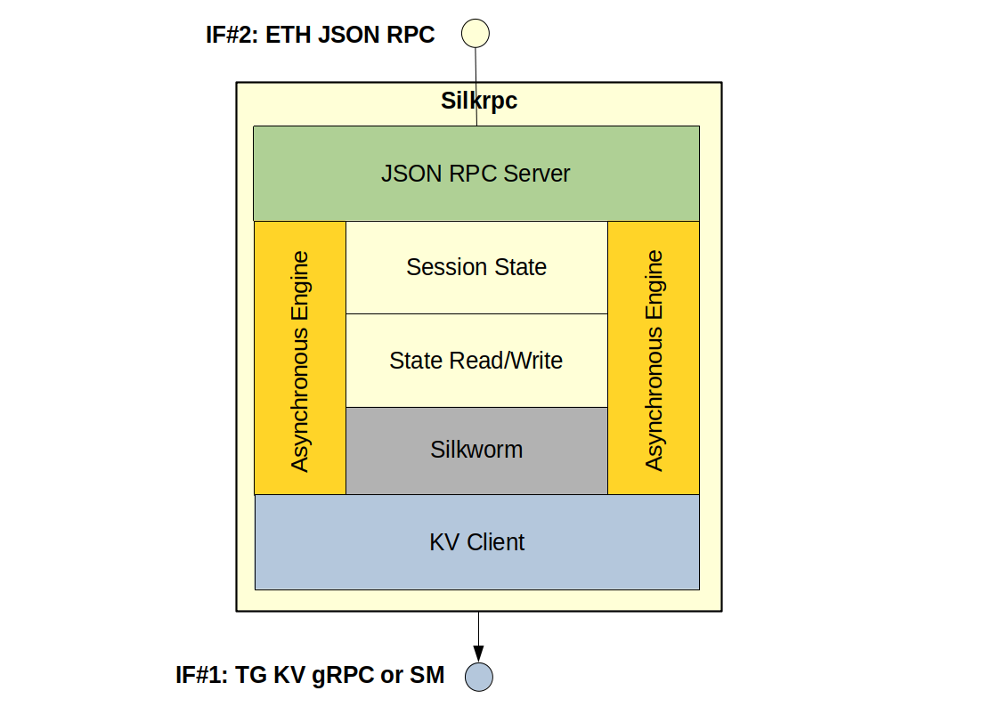

# SilkRPC Architecture

The context diagram of Silkrpc daemon is:

where the following interfaces are highlighted:

- **IF#1: TG gRPC KV / SM**: 
- **IF#2: ETH JSON RPC**: 
- **IF#3: ETH Binary gRPC**: 

The Silkrpc component is decomposed into the following packages:

- **JSON RPC Server**: 
- **Binary RPC Server**: 
- **Session State Machine**: 
- **State Read/Write**: 
- **KV Client**: 
- **Asynchronous Engine**: 
